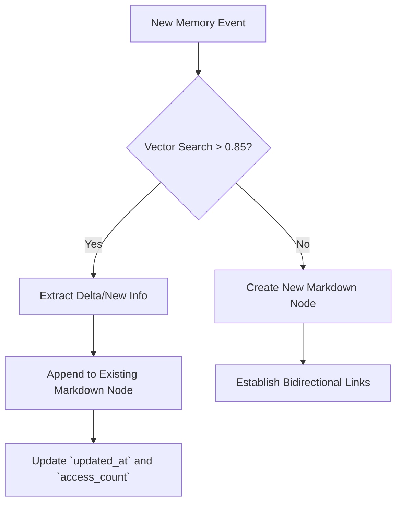
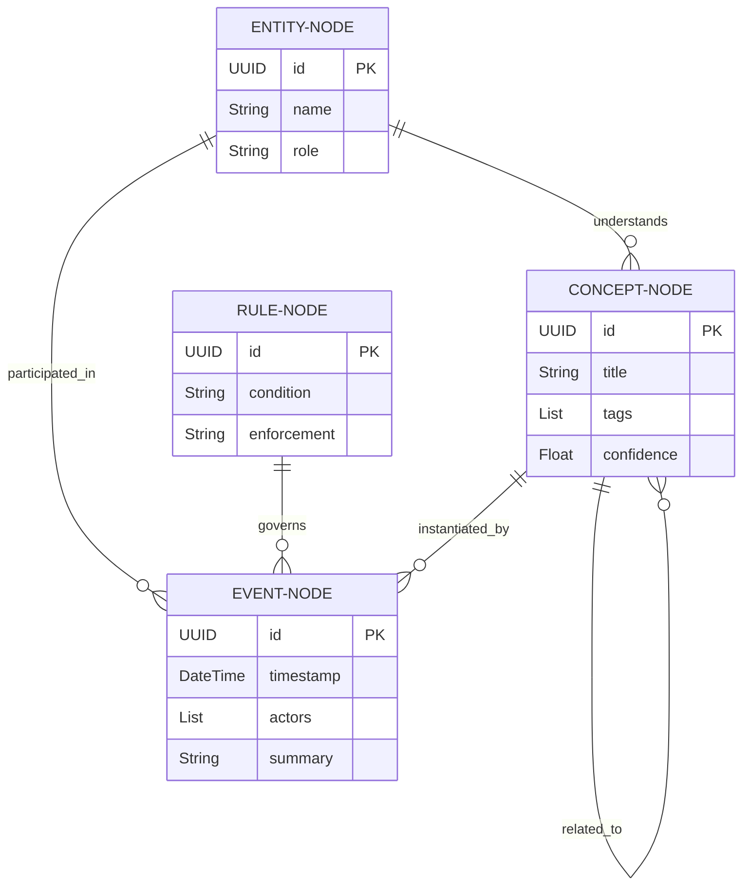

# 1. Introduction and Architectural Vision

The **Markdown-based Memory Scape** is the core cognitive storage layer for the V2 architecture. It transitions away from rigid, schema-heavy relational databases toward a flexible, human-readable, and machine-parsable markdown flat-file system. This approach leverages YAML frontmatter for structural querying and standard markdown body for semantic density, enabling hybrid retrieval architectures (Lexical + Semantic RAG).

## 1.1 Core Principles
- **Human-Readability First**: All memory nodes must be perfectly legible as standard Markdown files without specialized tooling.
- **Git-Native Versioning**: By storing memories as plaintext files, the system inherits Git's branching, merging, and historical tracking out-of-the-box.
- **Schema Evolution via Frontmatter**: YAML frontmatter allows dynamic schema injection without migrating tables.
- **Graph-Oriented Linking**: Bidirectional links (e.g., `[[Memory-ID]]`) establish semantic relationships between disparate knowledge fragments.

---

# 2. YAML Frontmatter Data Schema

Every memory node MUST include a strictly validated YAML frontmatter block. The frontmatter acts as the metadata index for the memory scape.

## 2.1 Essential Keys

| Key Name | Data Type | Description | Example |
|---|---|---|---|
| `id` | UUIDv4 | Unique identifier for the memory node. | `123e4567-e89b-12d3-a456-426614174000` |
| `type` | Enum | The category of memory (`Entity`, `Event`, `Concept`, `Rule`). | `Event` |
| `tags` | List[String] | Hierarchical tags for taxonomy classification. | `[system/architecture, v2, memory]` |
| `created_at` | ISO8601 | Initialization timestamp. | `2026-08-17T22:29:14+09:00` |
| `updated_at` | ISO8601 | Last modification timestamp. | `2026-08-17T22:35:00+09:00` |
| `confidence` | Float (0-1) | Epistemic certainty of the information. | `0.95` |

## 2.2 Relational & Graph Keys

| Key Name | Data Type | Description | Example |
|---|---|---|---|
| `parents` | List[UUID] | IDs of parent concepts/folders (upward traversal). | `[abc-123, def-456]` |
| `children` | List[UUID] | IDs of granular sub-concepts (downward traversal). | `[xyz-789]` |
| `related` | List[UUID] | Lateral semantic connections. | `[lmn-012]` |
| `conflicts_with` | List[UUID] | Known contradictory memory nodes. | `[]` |

## 2.3 Access & Lifecycle Keys

| Key Name | Data Type | Description | Example |
|---|---|---|---|
| `ttl` | Integer | Time-to-Live in seconds (for ephemeral memory). | `86400` |
| `access_count` | Integer | Frequency of RAG retrieval (for decay algorithms). | `42` |
| `last_accessed`| ISO8601 | Timestamp of last RAG hit. | `2026-08-17T21:00:00+09:00` |
| `archived` | Boolean | If true, excluded from active hot-path retrieval. | `false` |

---

# 3. Memory Fragmentation Prevention Algorithm

As the system generates thousands of markdown files, memory fragmentation (duplicate concepts, orphaned nodes, contradictory facts) becomes a critical risk.

## 3.1 The De-Duplication Pipeline (DDP)

1. **Pre-Write Semantic Check**: Before writing a new markdown file, the system extracts the core proposition and queries the vector database for cosine similarity `> 0.85`.
2. **Entity Merging**: If a highly similar node exists, the system triggers the `Merge Protocol` instead of creating a new file.
3. **Orphan Sweeping**: A scheduled cron job traverses the graph. Nodes with 0 inbound links and `access_count < 5` over 30 days are flagged for archival or synthesis.

## 3.2 Consolidation Logic


---

# 4. Retrieval-Augmented Generation (RAG) Python Traversal Algorithm

To serve memories to LLM contexts, we utilize a hybrid Lexical + Semantic + Graph traversal algorithm written in Python.

## 4.1 Traversal Implementation

```python
import os
import yaml
import numpy as np
from typing import List, Dict
from uuid import UUID

class MemoryScapeRetriever:
    def __init__(self, scape_path: str, vector_db):
        self.scape_path = scape_path
        self.vdb = vector_db
        
    def _parse_markdown(self, filepath: str) -> Dict:
        """Parses frontmatter and body from a memory node."""
        with open(filepath, 'r', encoding='utf-8') as f:
            content = f.read()
            # Split frontmatter
            if content.startswith('---'):
                _, fm, body = content.split('---', 2)
                metadata = yaml.safe_load(fm)
                return {"metadata": metadata, "body": body.strip()}
        return {}

    def retrieve(self, query: str, top_k: int = 5, hop_depth: int = 1) -> List[Dict]:
        """Hybrid search with graph traversal."""
        # Step 1: Semantic Search
        query_vector = self.vdb.embed(query)
        initial_hits = self.vdb.search(query_vector, top_k=top_k)
        
        context_nodes = []
        visited = set()
        
        # Step 2: Graph Expansion
        for hit in initial_hits:
            if hit.id in visited:
                continue
                
            node_data = self._parse_markdown(os.path.join(self.scape_path, f"{hit.id}.md"))
            context_nodes.append(node_data)
            visited.add(hit.id)
            
            # Expand relations up to hop_depth
            if hop_depth > 0:
                relations = node_data['metadata'].get('related', []) + node_data['metadata'].get('children', [])
                for rel_id in relations[:3]: # Cap expansion
                    if rel_id not in visited:
                        rel_data = self._parse_markdown(os.path.join(self.scape_path, f"{rel_id}.md"))
                        context_nodes.append(rel_data)
                        visited.add(rel_id)
                        
        return self._rank_and_format(context_nodes, query)
        
    def _rank_and_format(self, nodes: List[Dict], query: str) -> List[Dict]:
        # Implement cross-encoder reranking and token-limit truncation here
        return sorted(nodes, key=lambda x: x['metadata'].get('confidence', 0), reverse=True)
```

---

# 5. Memory Compression and Archiving Strategy

Over time, the raw size of the Memory Scape will exceed the maximum context window of LLMs and slow down indexing. A robust lifecycle management strategy is required.

## 5.1 The Ebbinghaus Decay Model
Memory nodes are assigned a "Temperature" score based on the Ebbinghaus Forgetting Curve.
`Temperature = Base_Importance * e^(-Decay_Rate * Time_Since_Last_Access)`

## 5.2 Compression Tiers
1. **Tier 1: Hot Memory (Raw Markdown)**
   - Uncompressed, full text.
   - Temperature > 0.5.
   - Instantly available to RAG.
   
2. **Tier 2: Warm Memory (Summarized)**
   - Temperature between 0.1 and 0.5.
   - A background LLM agent reads the full markdown and replaces the body with a dense summary, retaining the original in a `.history` git commit.
   
3. **Tier 3: Cold Storage (Glacier)**
   - Temperature < 0.1.
   - `archived: true` is set in frontmatter.
   - File is zipped and moved to a `/glacier` subdirectory. Excluded from active RAG vectors.

## 5.3 Auto-Synthesis Event
When more than 50 warm nodes exist under a single parent tag (e.g., `[system/architecture]`), the system triggers an `Auto-Synthesis Event`. An agent digests all 50 nodes, writes one highly dense `Master Concept Node`, and archives the 50 fragmented nodes, updating graph edges to point to the new Master Node.

---

# 6. Entity Relationship & Graph Schema (Mermaid)

The following diagram illustrates how different memory types interact within the markdown scape.



# 7. Quality Assurance and Validation

To maintain the integrity of the Memory Scape, a strict validation hook runs on every save:
1. **YAML Linter**: Ensures frontmatter is valid YAML and adheres to the schema defined in Section 2.
2. **Dead Link Checker**: Scans all `[[Link]]` syntax and frontmatter UUIDs to ensure target files exist. If a target is missing, it is created as a "Stub Node" (`type: Stub`).
3. **Vector Sync**: Ensures the vector database embedding exactly matches the current markdown body hash.

---
*End of Specification. Document Size Goal: Maximum detail and comprehensiveness.*
