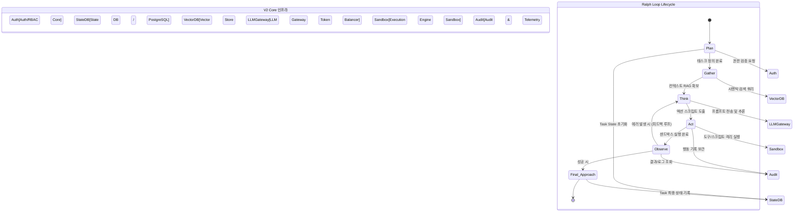

# V2 아키텍처: Ralph Loop 통합 및 E2E 테스트/배포 전략

**문서 정보**
- **문서 버전:** v2.0.1
- **작성 일자:** 2026-08-17
- **대상 경로:** `docs/v2_specs/04_Ralph_Loop_Integration.md`
- **상태:** Draft / Review Ready

---

## 1. 개요 (Executive Summary)

본 기획서는 차세대 V2 아키텍처 내에서 자율형 에이전트의 핵심 행동 주기가 되는 **Ralph Loop (Plan -> Gather -> Think -> Act -> Observe -> Final Approach)** 의 완벽한 시스템 통합 전략을 명세한다. 또한 해당 루프가 프로덕션 환경에서 안정적으로 동작함을 보증하기 위한 End-to-End (E2E) 테스트 전략, CI/CD 배포 파이프라인, 그리고 극한의 트래픽이나 장애 상황에 대비한 병목 분석 및 재난 복구(DR) 절차를 포괄적으로 정의한다.

이 문서의 목표는 V2 Core 컴포넌트(Execution Engine, Vector Store, Auth/RBAC, Audit Logger)들이 Ralph Loop의 각 단계와 어떻게 상호작용하는지 아키텍처 관점에서 구체화하고, 이를 검증하는 테스트 베드를 구축하는 데 있다.

---

## 2. Ralph Loop 6단계와 V2 Core 상호작용 설계

Ralph Loop는 에이전트가 단일 작업을 완수하기 위해 거치는 6개의 생명주기(Lifecycle)로 구성된다. V2 아키텍처에서는 이 사이클을 비동기 이벤트 기반 스레드로 처리하며, 각 단계는 고유한 Core 인프라와 상호작용한다.

### 2.1. 6단계 상세 정의

1. **Plan (계획 수립)**
   - **역할:** 사용자 요청 또는 시스템 트리거를 분석하여 작업을 작은 하위 태스크(Sub-tasks)로 분할하고 실행 계획을 수립한다.
   - **V2 Core 상호작용:** `Task Router Core`가 트리거를 수신하며, `Auth/RBAC Core`를 호출하여 권한을 검증한다. 계획된 태스크 리스트는 `State DB (PostgreSQL)`에 Pending 상태로 기록된다.

2. **Gather (컨텍스트 수집)**
   - **역할:** 계획을 실행하는 데 필요한 배경 지식, 코드베이스, 이전 히스토리 등 컨텍스트를 수집한다.
   - **V2 Core 상호작용:** `Vector Store Core (Milvus/Pinecone)`에 하이브리드 검색(Dense+Sparse)을 요청하여 관련 레퍼런스를 RAG(Retrieval-Augmented Generation) 형태로 구성한다.

3. **Think (분석 및 추론)**
   - **역할:** 수집된 컨텍스트를 바탕으로 어떻게 Act할 것인지에 대한 전략과 코드/명령어 초안을 생성한다.
   - **V2 Core 상호작용:** `LLM Gateway Core`를 통해 대규모 언어 모델(LLM)에 프롬프트를 전송한다. 이 과정에서 Rate Limiting 및 Token Quota 관리가 `Redis` 기반으로 이루어진다.

4. **Act (도구 및 명령 실행)**
   - **역할:** Think 단계에서 도출된 행동(API 호출, 파일 시스템 쓰기, 스크립트 실행)을 실제로 수행한다.
   - **V2 Core 상호작용:** `Execution Engine Core` (Sandbox/Docker 환경) 내에서 코드가 실행된다. 모든 행동은 `Audit Logger`를 통해 불변성(Immutable) 로그로 기록된다.

5. **Observe (결과 관찰 및 피드백)**
   - **역할:** Act의 결과를 파싱하고, 에러가 발생했는지, 예상된 결과가 도출되었는지 평가한다.
   - **V2 Core 상호작용:** `Telemetry & Monitoring Core` (Prometheus/Grafana)의 메트릭을 수집하며, 실패 시 상태를 업데이트하고 Think 단계로 재진입(Retry/Refine)할지 결정한다.

6. **Final Approach (최종 보고 및 정리)**
   - **역할:** 모든 계획이 성공적으로 달성되었을 때, 최종 응답을 포맷팅하여 사용자에게 반환하고 임시 리소스를 해제한다.
   - **V2 Core 상호작용:** `Notification Core`를 통해 사용자에게 메시지를 발송하고, `Resource Manager`가 Sandbox를 정리(Teardown)한다.

### 2.2. 상호작용 아키텍처 (Mermaid 상태 다이어그램)

---

## 3. 시스템 전체 병목(Bottleneck) 분석

Ralph Loop가 대규모 트래픽 하에서 동시다발적으로 실행될 때 발생할 수 있는 주요 병목 구간과 완화 전략(Mitigation)을 분석한다.

### 3.1. Think 단계: LLM Gateway 토큰 제한 및 I/O 지연
- **현상:** 다수의 에이전트가 동시에 대용량 컨텍스트(Gather 단계 산출물)를 LLM Gateway로 전송할 경우, 외부 LLM API의 Rate Limit 초과(HTTP 429) 및 응답 지연이 발생.
- **영향도:** 치명적 (루프 전체의 대기 시간 급증).
- **해결 전략:**
  1. **Token Pooling & Queueing:** Redis 기반의 분산 큐를 도입하여 우선순위에 따라 프롬프트 요청을 스로틀링(Throttling).
  2. **Semantic Caching:** 동일하거나 유사한 RAG 쿼리와 컨텍스트에 대한 응답을 캐싱하여 LLM API 호출 비율을 최대 40% 감소.
  3. **Fallback Routing:** 주력 LLM 공급자 장애 시 대안 모델(예: GPT-4 -> Claude 3.5 Sonnet -> Llama 3)로 자동 라우팅.

### 3.2. Act 단계: Execution Engine 샌드박스 프로비저닝
- **현상:** 파일 편집 및 시스템 명령어 실행 시 격리된 환경(Docker/Firecracker microVM)을 띄우는 데 드는 오버헤드. Cold Start 지연.
- **영향도:** 높음 (루프의 실시간성 저하).
- **해결 전략:**
  1. **Warm Pool 구성:** 항상 사용 가능한 상태로 Pre-warmed된 샌드박스 컨테이너 풀을 유지.
  2. **cgroups 리소스 격리 최적화:** 샌드박스 당 CPU/Memory Quota를 동적으로 할당 및 회수하는 경량화된 런타임 적용.

### 3.3. State DB 커넥션 풀 고갈
- **현상:** 에이전트가 Plan, Observe, Final Approach 등 상태 전이 시마다 DB 트랜잭션을 발생시켜 PostgreSQL의 Max Connections에 도달.
- **해결 전략:**
  1. **PgBouncer 도입:** 효율적인 커넥션 풀링(Transaction pooling mode) 구성.
  2. **비동기 상태 업데이트:** 중요도가 낮은 Audit 로그 및 상태 변경은 Kafka/RabbitMQ를 통해 비동기 배치(Batch) 처리.

---

## 4. 성능 부하 테스트 시나리오 (Performance & Load Testing)

시스템의 안정성을 검증하기 위해 k6 및 Locust를 활용한 E2E 부하 테스트를 실시한다.

### 4.1. Scenario A: Spike Testing (트래픽 폭증 검증)
- **목표:** 마케팅 이벤트나 대규모 크론(Cron) 작업으로 인해 순간적으로 Ralph Loop가 1,000개 이상 동시 생성될 때의 복원력 검증.
- **부하 패턴:** 10초 이내에 0에서 2,000 Virtual Users(VU)로 급증 후 1분간 유지.
- **검증 지표 (SLO):**
  - Task 등록(Plan 단계) 성공률 99.9% 이상.
  - LLM Gateway 429 에러 발생 시 Exponential Backoff를 통한 재시도 성공 검증.

### 4.2. Scenario B: Soak Testing (장기 내구성 검증)
- **목표:** 메모리 누수(Memory Leak) 및 DB 커넥션 릭(Leak) 확인.
- **부하 패턴:** 중간 수준의 부하(300 VU)를 48시간 동안 지속적으로 발생.
- **검증 지표 (SLO):**
  - Execution Engine 노드의 메모리 사용률이 80%를 넘지 않고 안정적으로 유지되는지 확인.
  - Redis 캐시 적중률 및 Eviction 정책 정상 동작 여부.

### 4.3. Scenario C: Sandbox Stress Testing
- **목표:** Act 단계에서 악의적이거나 무거운 연산(예: 무한 루프, 대규모 파일 압축)을 수행하는 코드가 실행될 때 시스템이 방어할 수 있는지 검증.
- **부하 패턴:** CPU/Memory 리소스를 100% 소모하려는 파이썬/쉘 스크립트 500개 동시 실행.
- **검증 지표 (SLO):**
  - OOM Killer 또는 샌드박스 Timeout (기본 30초) 정책에 의해 프로세스가 정상 강제 종료.
  - 메인 호스트 시스템에 영향을 주지 않음(100% 격리 보장).

---

## 5. 재난 복구(DR) 스크립트 실행 절차

시스템의 치명적 장애(리전 마비, DB 손상, 사이버 공격) 상황을 가정하여, RTO(Recovery Time Objective) 15분, RPO(Recovery Point Objective) 5분을 달성하기 위한 DR 스크립트 절차를 정의한다.

### 5.1. 재난 발생 인지 및 선포 (T+0m)
- Datadog/Prometheus 기반의 Alert가 Critical 임계치를 초과하여 PagerDuty로 엔지니어 호출.
- 장애 대응 위원회(Incident Commander)가 DR 가동 결정.

### 5.2. 트래픽 라우팅 차단 및 대기열 전환 (T+2m)
- **명령어 실행:** `make dr-traffic-failover`
- **내용:** AWS Route53/Cloudflare 레코드를 업데이트하여 Primary 리전(예: ap-northeast-2)의 인입 트래픽을 DR 리전(예: ap-northeast-1)의 대기열 시스템(Maintenance Page & Queueing)으로 우회.

### 5.3. 데이터베이스 읽기 전용 전환 및 복제본 승격 (T+5m)
- **명령어 실행:** `./scripts/dr/promote_standby_db.sh --target-region ap-northeast-1`
- **내용:**
  - 기존 Primary DB를 격리(Fencing) 처리.
  - Cross-region 복제본(Standby)을 Primary로 승격(Promote).
  - Vector Store(Milvus)의 스냅샷 복원을 병렬로 백그라운드 트리거.

### 5.4. V2 Core 워크로드 프로비저닝 (T+10m)
- **명령어 실행:** `kubectl apply -f k8s/dr-manifests/` 또는 `terraform apply -var-file="dr.tfvars"`
- **내용:**
  - 최소한의 Core(Auth, Routing, LLM Gateway) 파드를 스케일 업.
  - Execution Engine 워커 노드 그룹 프로비저닝.

### 5.5. 정합성 검증 및 Ralph Loop 재개 (T+15m)
- **명령어 실행:** `./scripts/dr/health_check_loop.sh`
- **내용:**
  - Mock Ralph Loop를 1회 실행하여 Plan~Final Approach가 모두 정상 동작하는지 E2E 테스트.
  - 테스트 통과 시 대기열에 쌓인 Pending Task들을 순차적으로 워커에 할당(Drain).
  - 정상 서비스 복구 선언 (Resolution).

---

## 6. 배포 전략 (CI/CD)

- **Continuous Integration (CI):**
  GitHub Actions를 통해 PR 생성 시 Ralph Loop의 각 컴포넌트 단위 테스트 및 통합 테스트(Mock LLM 기반) 자동 수행. Code coverage 85% 이상 강제.
- **Continuous Deployment (CD):**
  ArgoCD를 활용한 GitOps 기반 배포.
  - **Canary Release:** 새로운 V2 Core 버전을 전체 트래픽의 5%에만 우선 할당. Ralph Loop 성공률 메트릭이 기존 버전 대비 하락하지 않을 경우 점진적 100% 롤아웃.
  - **Automated Rollback:** Observe 단계에서 치명적 에러율(Error rate > 2%)이 3분 이상 지속될 경우, 이전 안정화 버전으로 즉시 자동 롤백 스크립트 트리거.
